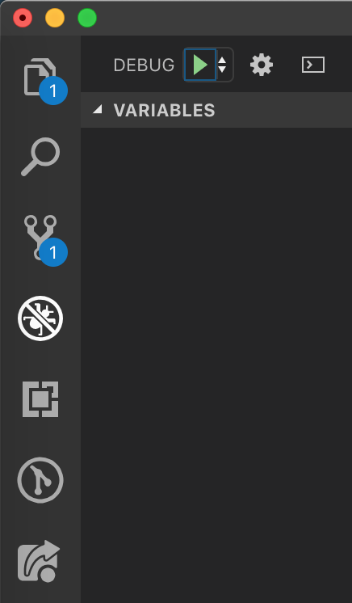
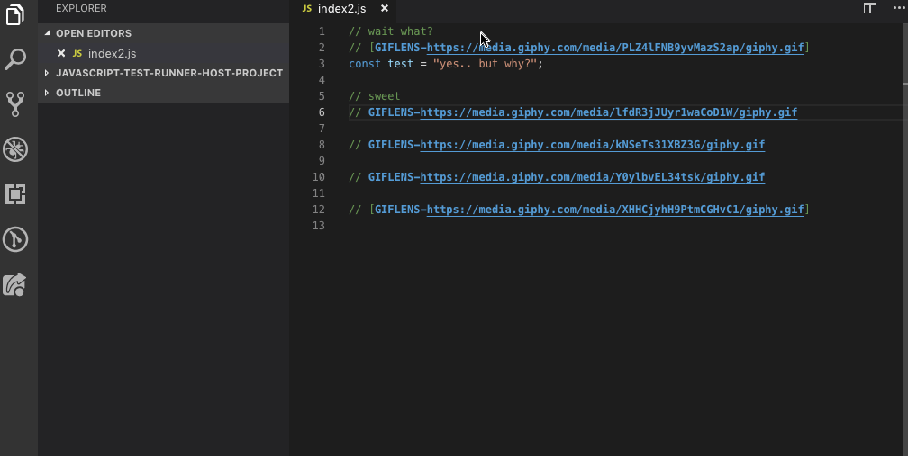

# Giflens

> GifLens **supercharges** the GIF capabilities built into Visual Studio Code. It helps you to **visualize GIFs** at a glance using `GIFLENS` tags and code lens, **seamlessly navigate and explore** Gif repositories, **gain valuable insights** via powerful GIFs, and so much more.

## Features

Visualize GIFLENS tags just by hovering them in your code.

IMAGE GOES HERE
\!\[feature X\]\(images/feature-x.png\)

Search for GIFs using the `giflens` command directly in VS Code.

IMAGE GOES HERE
\!\[feature X\]\(images/feature-x.png\)

## Requirements

Just install `giflens` in the VS Code extension panel.

## Extension Settings

Coming soon.

## Debugging / Testing the extension locally

To run the extension locally, clone the repo, then just run the project in the debugging tab, it should be automatically recognized by VS Code.

VS Code wuill open another editor where you can test inserting and previewing Gifs.

## Known Issues

## Release Notes

### 1.0.0-alpha

Just looking around 👀

## Thank you

- The VS Code team for building an awesome open source IDE 🙏
- The Gitlens team who helped us finding a name for this extension. Love your product too ❤️
- The Giphy team for their great api and endless database of amazing GIFs 😎

**Enjoy!**
