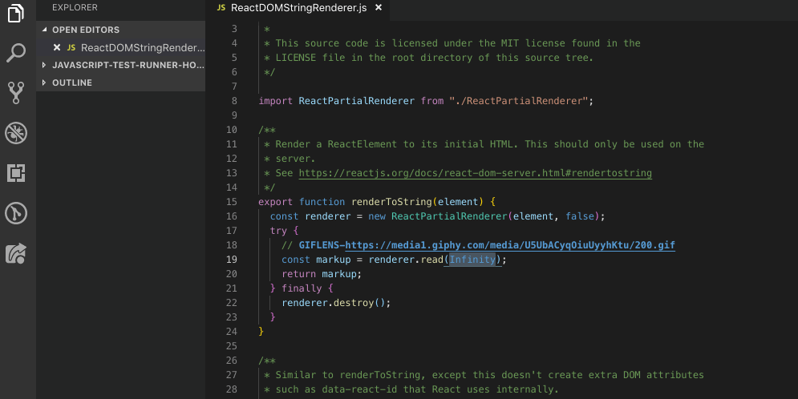
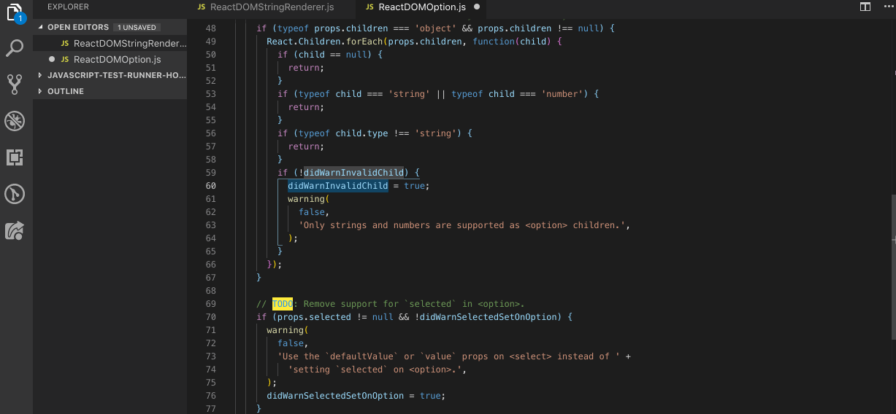

# Giflens

> GifLens **supercharges** the GIF capabilities built into Visual Studio Code. It helps you to **visualize GIFs** at a glance using `GIFLENS` tags and code lens, **seamlessly navigate and explore** Gif repositories, **gain valuable insights** via powerful GIFs, and so much more.

## Features

Visualize GIFLENS tags just by hovering them in your code.

Search for GIFs using the `giflens` command directly in VS Code.

## Requirements

Just install `giflens` in the VS Code extension panel.

## Extension Settings

Coming soon.

## Debugging / Testing the extension locally

To run the extension locally, clone the repo, then just run the project in the debugging tab, it should be automatically recognized by VS Code.

VS Code will open another editor where you can test inserting and previewing Gifs.

## Known Issues

## Release Notes

### 1.0.0

- hover a GIFLENS tag to visualize a gif inside your code editor
- VS Code command to search a gif and inserting it when clicking on the preview
- Supported languages :
  - bat scripts
  - clojure
  - coffeescript
  - C
  - C++
  - C#
  - CSS
  - Dockerfile
  - F#
  - Go
  - Groovy
  - HTML
  - Java
  - JavaScript
  - JSX
  - LESS
  - LUA
  - Makefile
  - Objective C
  - Objective C++
  - Perl
  - PHP
  - Powershell scripts
  - Python
  - R
  - Ruby
  - Rust
  - SASS / SCSS
  - SQL
  - Swift
  - TypeScript
  - TSX
  - Visual Basic
  - Yaml

## Thank you

- The [VS Code](https://code.visualstudio.com/) team for building an awesome open source IDE 🙏
- The [Gitlens](https://github.com/eamodio/vscode-gitlens) team who helped us finding a name for this extension. Love your product too ❤️
- The [Giphy](https://giphy.com/) team for their great api and endless database of amazing GIFs 😎

**Enjoy!**
